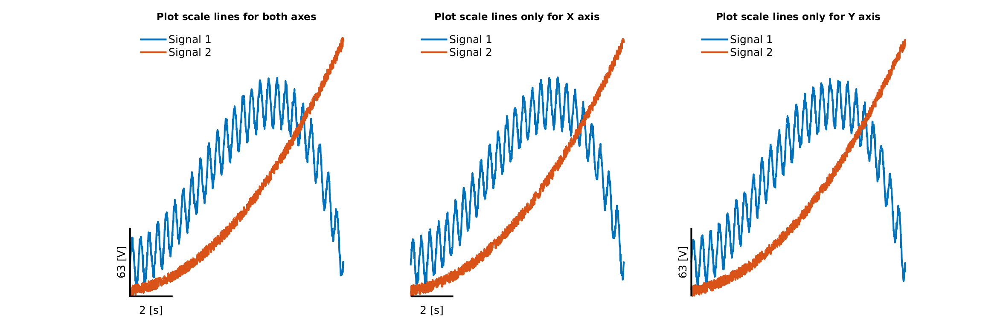

# What can I do with `plotAxesScaleBars.m`?

`plotAxesScaleBars` is a function that allows to draw scale bars for the X and Y axes in a MATLAB plot, instead of the default axes. This is often preferred to improve the readability of graphs.

The function can be used to draw scale bars for both axes or only for one of the X and Y axes through the last input argument `whattoplot`.

# How should  I use it?
Please read the documentation inside the function.

An example script using the function is provided as well in this repository.
